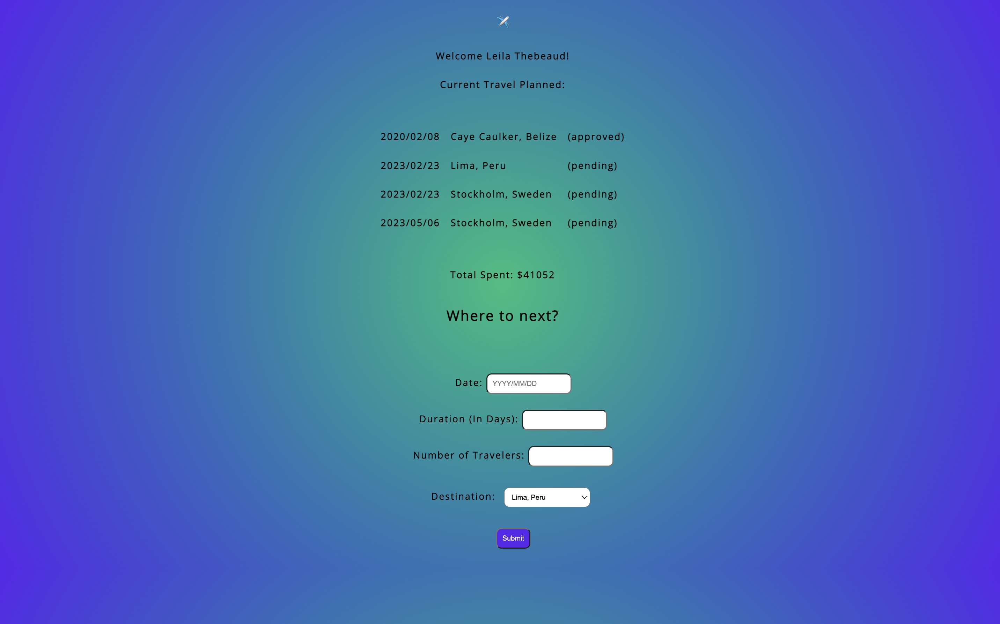

# ✈️ Travel Tracker

## 💾 Technologies Used

## 👩‍💻 👩‍💻 👨‍💻 👩‍💻 Collaborators
[Ben Rosner](https://github.com/ben-rosner-williamsburg)

## 💭 Abstract

Travel Tracker allows users to track their trips they schedule through a travel agency. Users can login, track trips they have scheduled as well as add trips. Trips that are added manually are listed as pending.

## 📝  Context
I am a front-end developer who worked through the GitHub project board to complete this application. This project was completed as my final project for Mod 2 of the Front End development program at Turing School of Software & Design. 

## 🎥 Preview 

## 🔌 Server Setup
- Fork [this](https://github.com/turingschool-examples/travel-tracker-api) repository. 
- Clone it to your local machine using the command: `git@github.com:turingschool-examples/travel-tracker-api.git`.
- Run the command: `cd travel-tracker-api`
- Run the command: `npm install`
- Run the command: `npm start`

## Client App Setup
- Clone it to your local machine using the command: `git@github.com:ben-rosner-williamsburg/travel-tracker.git`
- Run the command: `cd travel-tracker`
- Run the command: `npm install`
- Run the command: `npm start`

## 📚 Learning Goals
- Use object and array prototype methods to perform data manipulation
- Create a clear and accessible user interface
- Make network requests to retrieve data
- Implement a robust testing suite using TDD
- Write DRY, reusable code that follows SRP (Single Responsibility Principle)

## 🥇 Wins
⭐ Writing clean code that is easy to follow.
  
⭐ Developed strong code organization and project management skills using GitHub project boards.

⭐ Writing tests using Mocha and Chai.
	

## 🚧 Challenges
❗ Writing "sad path" tests.

❗ Figuring out how to resolve a promise that is not an iterable.

❗ Writing code that is DRY.
